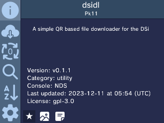
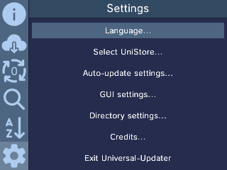
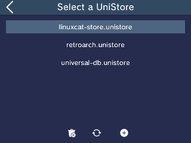
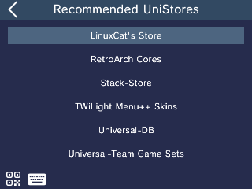
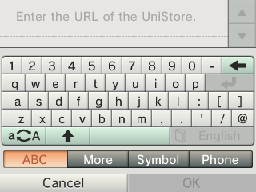
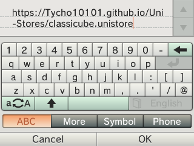

## How To Use 
(Requires modded 3ds, or emulator)
 1. Goto/get [Universal-Updater](https://universal-team.net/projects/universal-updater.html#downloads). 

 3. Goto settings at the bottom left corner. 

 5. Goto "Select UniStore..." 

 7. Hit the + button on the bottom 

 9. Hit the Keyboard icon 

 11. Put in the url for the UniStore that you want in the follow in list

|Name|Url|
|-|-|
|classicube.unistore|https://Tycho10101.github.io/Uni-Stores/classicube.unistore|
